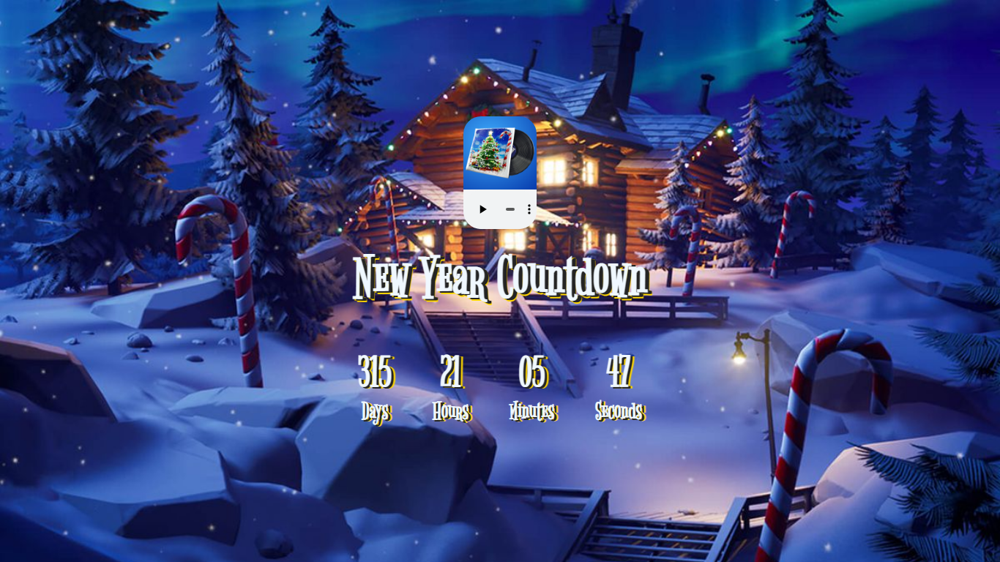

# Project Title

Fortinte-Themed New Year Countdown Timer

## Description

The main purspose for this project was is to test my JavaScript skills in creating simple yet useful and fun app.
P.S. THIS PROJECT MAY NOT BE FULLY OPTIMISED ON ALL BROWSERS EXCEPT FOR CHROME - THE MP3 PLAYER

## Preview


## Getting Started

### Dependencies

* HTML, CSS and Vanilla JavaScript
* Background image is a property of Fortnite.Inc, thus it's only for personal use.

### Installing

* Download the "index" HTML file, "style" CSS file and "app" JavaScript file and the Assets- only wintefest.0.jpg image is needed in this folder.

### Executing program

* Make sure to download all files mentioned above with the assets folder and put them in a folder
* Open VSCode and open a new workspace and add that foler you just created.
* Adjust the 'src' attirbutes to match the files location.
* Voila! Run the code and enjoy the functionality!
```
code blocks for commands
```

## Help

Any advise for common problems or issues.
```
command to run if program contains helper info
```

## Authors

Contributors names and contact info

ex. Hatem   
ex. [@codenkoffee](https://www.instagram.com/codenkoffee/)

## Version History

* 0.2
    * Various bug fixes and optimizations
    * See [commit change]() or See [release history]()
* 0.1
    * Initial Release

## License

This project's source code can be used for personal use or GitHub projects EXCEPT for the the background images which are a proprty of Fortnite.Inc, use at your own risk.

